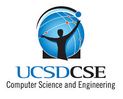

# Brian Wen 




Hello, my name is Brian Wen and I am an aspiring **software engineer**, currnetly in my third year of studies at *UCSD* as a computer science major. I have spent my whole life living in Soutern California, pictured above. 
Below is one of my favorite quotes:

> “We can only see a short distance ahead, but we can see plenty there that needs to be done.” - Alant Turing


Below is the pseudocode for Dijkstra's algorithm, one of my favrorite algorithm's. 
```
function Dijkstra(Graph, source):
      for each vertex v in Graph.Vertices:
          dist[v] ← INFINITY
          prev[v] ← UNDEFINED
          add v to Q
      dist[source] ← 0
     
      while Q is not empty:
          u ← vertex in Q with min dist[u]
          remove u from Q
         
          for each neighbor v of u still in Q:
              alt ← dist[u] + Graph.Edges(u, v)
              if alt < dist[v]:
                  dist[v] ← alt
                  prev[v] ← u

      return dist[], prev[]
```

[External link to personal website](https://briannwhen.github.io/)

[Section link to end](#skills-to-learn)

[Relative link to README](README.md)


## Inspirations
- Ariana Grande 
- John Adams
- Alicia Keys 


## Favorite UCSD courses
1. CSE101 - Design and Analysis of Algorithms 
2. CSE105 - Theory of Computation
3. CSE30 - Computer Organization and Systems Programming


## Skills to learn
- [x] CSS/HTML/JavaScript
- [ ] React
- [ ] Ruby on Rails 
  
